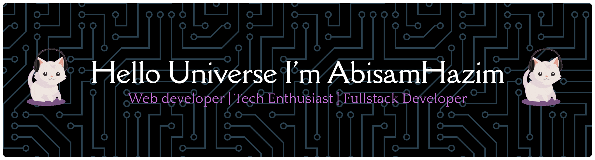

# 👋 Hi, I’m Abisam Hazim

I’m a junior web developer and also an active student.  
I enjoy learning new things and turning ideas into simple, useful websites.  
Most of the time I’m exploring how to make apps look good, run smoothly,  
and give a nice experience for people who use them.  

Even though I’m still in the learning stage, I always try to write clean code,  
keep improving my skills, and love working together in a team. 🚀  

---

## 🌐 Socials
 

  
  
  
  

---

## 🛠 Tech Stack
 
  
 
 

 

---

## 📈 Contribution Graph
  

---

✨ *"Keep learning, keep building, and stay curious."* 🚀

<!-- Proudly created with GPRM ( https://gprm.itsvg.in ) -->
